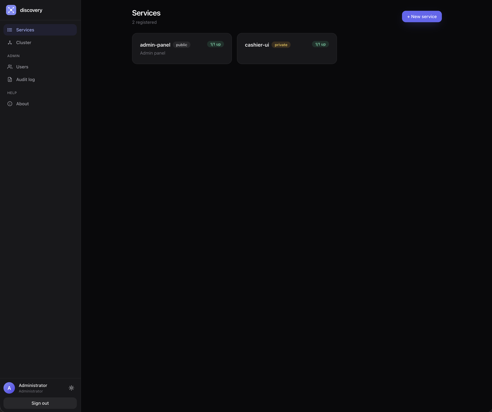

# discovery2 — `corp-module` branch

Service-discovery server with a built-in React UI, gossip-based clustering,
**[corp-ui](https://github.com/corp-ui/corp-ui) SSO** (hybrid iframe + custom
login page), per-service ACL, and an audit trail. Single self-contained Go
binary — bbolt for state, no external DB.

> This is the corp-module fork of upstream discovery2. Auth is delegated to
> corp-ui; there is no local user store. For the upstream local-users
> variant, use `master`.

The companion Go client library is its own repository:
[github.com/axgrid/ax-discovery2-client](https://github.com/axgrid/ax-discovery2-client).



## Features

- **Services + instances.** Register a logical service, attach one or more
  running instances, describe the network interfaces each instance exposes
  (`WEB`, `WS`, `TCP:4000`, `GRPC`, …).
- **Per-instance health modes.** `heartbeat` (the default — the service pings
  discovery), `http` / `tcp` (discovery actively probes the instance), or
  `none` (no auto-status). HTTP/TCP modes probe **every** matching interface
  and require **all** to pass — multi-interface instances fail health if any
  one of them does. The latest probe report is persisted on the instance and
  surfaced in the UI: failed interfaces appear red.
- **On-demand check.** Each instance has a **Check** button that runs a probe
  synchronously and shows the per-interface result (URL, HTTP status, latency,
  error). Useful for debugging registrations.
- **Versioned discovery.** Each instance carries a semver `version`; query with
  npm-style constraints (`?version=>=2.1.0`, `^2.1.0`, `~2.1.0`, `1.x`,
  `1.2.0 - 1.3.5`). Ask for a flat address list or let the server pick one.
- **Multi-address balancing.** The Go client library picks healthy instances
  via `RoundRobin` (default), `Random`, or `Weighted` strategies, and
  refreshes its view live over WebSocket. Server-side `/pick` adds **sticky
  token** affinity (persisted, cluster-replicated) and weighted selection.
- **Operator block.** Take an instance out of rotation with one click to
  rebalance traffic — without deleting it, and surviving the owning client's
  re-registration.
- **Config store.** Cluster-replicated variables & settings with typed values
  (string/int/float/bool/json/bytes), block-atomic versioning + rollback, and
  `global < service < version` resolution. Edit in the **Config** UI tab.
- **Dynamic client tokens.** Mint revocable read/write/admin bearer tokens from
  the UI (no env edit / restart) — visible to write/admin only.
- **Live dashboard + Prometheus metrics.** A service-card dashboard shows
  per-version health, request rate (sparkline), a live lookup feed, and which
  clients call which services. `/metrics` exposes `discovery_up{service,version}`
  for Grafana alarms (e.g. alert when a version drops to 0 instances).
- **Fault-tolerant cluster.** Nodes find each other via gossip
  (`hashicorp/memberlist`), broadcast change events, and reconcile via
  periodic anti-entropy snapshots. Last-write-wins on `UpdatedAt`. Peers can
  be added at runtime from the UI by an admin. Gossip can be **encrypted**
  (`DISCOVERY_GOSSIP_SECRET`) and the snapshot endpoint token-gated.
- **Corp-ui SSO + per-service ACL.** Users live in corp-ui. Two parallel
  paths: iframe-token Bearer (introspected via corp-ui's `/api/iframe/introspect`)
  or our own `/v1/auth/login` form that delegates to corp-ui's
  `verify-password` server-to-server and mints a short-lived cookie session.
  Static API tokens still work for service-to-service traffic. Services are
  `public` (any authenticated user can edit) or `private` (only owner /
  admin / explicitly-granted users can edit). Discovery is unrestricted
  regardless of visibility.
- **Audit log.** Every mutation (service / instance / grant / login /
  cluster join) is recorded with actor, target, and a details blob; admins
  browse it in the UI with filtering by service.
- **Storage:** embedded BoltDB, single file. UI is embedded into the binary.
- **REST API + WebSocket** for change events.
- **Light / dark theme**, embedded SVG favicon, PWA manifest.

## Quick start

```bash
cp .env.example .env       # set CORP_URL + CORP_API_KEY at minimum
make build                 # builds UI + binary; output at ./discoveryd
./discoveryd
```

Open <http://localhost:8500> and sign in with your **corp-ui** credentials.
Without `CORP_URL` set, the login form refuses to submit — discovery has
no local fallback user. For air-gapped clusters / CI, use a static admin
token (`DISCOVERY_ADMIN_TOKENS`) as `Authorization: Bearer ...`.

First-time setup in corp-ui:

1. `Admin → Services → New`: slug `discovery`, iframe URL (your discovery host).
2. `Admin → Services → discovery → Edit → Regenerate API key` — paste the
   `cks_...` value into `CORP_API_KEY`.
3. `Admin → Groups → Permissions`: grant `discovery` r/w/a to the groups
   that should see discovery in the sidebar.

### Cross-compile for Linux

```bash
make build-linux             # both amd64 + arm64
make build-linux-amd64       # just amd64
make build-linux-arm64       # just arm64
make build-all               # native + both Linux archs
```

Output: `bin/discoveryd-linux-amd64` and `bin/discoveryd-linux-arm64`.
Statically linked (`CGO_ENABLED=0`), stripped (`-s -w`); ~8 MB each. Runs
on any glibc / musl distribution without further dependencies.

### Two-node cluster (one machine)

```bash
make run-cluster
```

Both UIs (`:8500`, `:8501`) show the same data. The router is force-disabled in
this mode (see below).

### Expose through ax-router2 (optional)

Off by default. Set `AX_ROUTER_ENABLE=true` plus `AX_ROUTER_HOST` /
`AX_ROUTER_TOKEN` (and optionally `AX_ROUTER_NAME`) in `.env`, then:

```bash
make run-router          # single node with the reverse router connected
```

The API becomes reachable at `https://<AX_ROUTER_NAME>.<router-base>` without
opening the service port. **Enable it on only one node** — every cluster node
shares `.env` and ax-router is last-writer-wins per service name, so enabling it
everywhere makes nodes fight over the name. `make run-cluster` passes
`-ax-router=false` to guarantee it stays off there.

### Configuration

All flags also accept env vars (`DISCOVERY_*`). See `.env.example`.

| Flag | Env | Default | |
|---|---|---|---|
| `-listen` | `DISCOVERY_LISTEN` | `:8500` | API + UI bind |
| `-db` | `DISCOVERY_DB` | `./discovery.db` | bbolt file |
| `-node-id` | `DISCOVERY_NODE_ID` | hostname | gossip node name |
| `-gossip-bind` / `-gossip-port` | `DISCOVERY_GOSSIP_*` | `0.0.0.0` / `7946` | |
| `-advertise-ip` | `DISCOVERY_ADVERTISE_IP` | auto | gossip advertise |
| `-advertise-api` | `DISCOVERY_ADVERTISE_API` | `127.0.0.1:<port>` | host:port peers should use to reach our HTTP API |
| `-seeds` | `DISCOVERY_SEEDS` | (none) | comma-separated `host:port` |
| `-cluster-token` | `DISCOVERY_CLUSTER_TOKEN` | (none) | shared secret for `/cluster/snapshot` |
| `-gossip-secret` | `DISCOVERY_GOSSIP_SECRET` | (none) | base64 16/24/32-byte key encrypting gossip (all nodes must match) |
| `-affinity-ttl` | `DISCOVERY_AFFINITY_TTL` | `1200` | sticky-token idle timeout, seconds (`pick?token=`) |
| `-read-tokens` / `-write-tokens` / `-admin-tokens` | `DISCOVERY_*_TOKENS` | (none) | comma-separated; bypass corp-ui as `system` identity |
| `-allow-anonymous-read` | `DISCOVERY_ALLOW_ANON_READ` | `true` | |
| `-corp-url` | `CORP_URL` | (none) | base URL of the corp-ui console — required for UI login |
| `-corp-api-key` | `CORP_API_KEY` | (none) | per-service API key from corp-ui |
| `-corp-slug` | `CORP_SERVICE_SLUG` | `discovery` | slug discovery is registered under in corp-ui |
| `-corp-perm-key` | `CORP_PERM_KEY` | `discovery` | corp-ui permission key whose r/w/a gates discovery |
| `-ax-router` | `AX_ROUTER_ENABLE` | `false` | expose the API through an ax-router2 reverse router (off by default) |
| `-ax-router-host` | `AX_ROUTER_HOST` | (none) | router control `host:port` (default port 7000); required when enabled |
| `-ax-router-token` | `AX_ROUTER_TOKEN` | (none) | ax-router2 shared token |
| `-ax-router-name` | `AX_ROUTER_NAME` | `discovery` | service name to advertise on ax-router2 |
| `-acme` | `DISCOVERY_ACME_ENABLE` | `false` | Enable automatic HTTPS via Let's Encrypt |
| `-acme-domains` | `DISCOVERY_ACME_DOMAINS` | (none) | Comma-separated hostnames the server is allowed to issue certs for |
| `-acme-email` | `DISCOVERY_ACME_EMAIL` | (none) | Optional contact email registered with Let's Encrypt |
| `-acme-cache` | `DISCOVERY_ACME_CACHE` | `./certs` | Cert cache directory; must persist across restarts |
| `-acme-staging` | `DISCOVERY_ACME_STAGING` | `false` | Use the staging directory (untrusted certs, no rate limits) |
| `-https-listen` | `DISCOVERY_HTTPS_LISTEN` | `:443` | HTTPS bind when ACME is on |
| `-acme-http-listen` | `DISCOVERY_ACME_HTTP_LISTEN` | `:80` | HTTP bind for ACME challenges + redirect |

Liveness checks are configured **per instance** (`CheckMode` field), not via
a server-wide flag.

### Automatic HTTPS via Let's Encrypt

`discoveryd` ships with [autocert](https://pkg.go.dev/golang.org/x/crypto/acme/autocert)
support — flip `DISCOVERY_ACME_ENABLE=true`, list your domains, and it will
fetch and renew certificates from Let's Encrypt automatically. Plain HTTP on
:80 keeps running for the ACME `http-01` challenge and to redirect everything
else to HTTPS.

Minimal `.env`:

```
DISCOVERY_ACME_ENABLE=true
DISCOVERY_ACME_DOMAINS=discovery.example.com
DISCOVERY_ACME_EMAIL=ops@example.com
DISCOVERY_ACME_CACHE=/var/lib/discovery/certs
```

What you need to set up yourself:

- Public DNS `A` / `AAAA` records for every host in `DISCOVERY_ACME_DOMAINS`
  pointing at this server.
- Ports **80 and 443 reachable from the public internet**. Run as root,
  set `CAP_NET_BIND_SERVICE`, or port-forward via a load balancer / iptables.
- A persistent `DISCOVERY_ACME_CACHE` directory. Don't put it in `/tmp`;
  Let's Encrypt rate-limits cert issuance and you'll lock yourself out
  if certs disappear on every restart.
- Outbound HTTPS reachability to `acme-v02.api.letsencrypt.org`.

Test the wiring without burning quota: `DISCOVERY_ACME_STAGING=true` switches
to LE's staging directory. Browsers will refuse the cert, but you can
confirm the issuance flow works. Flip back to `false` for real certs.

The first request after a cold start may take several seconds while the
cert is issued; subsequent requests use the cache.

## REST API

```
# Auth — cookie session (standalone) OR iframe Bearer JWT (corp-ui)
POST   /v1/auth/login           # body: {"identifier":"email-or-username","password":"..."}
POST   /v1/auth/logout
GET    /v1/auth/me              # returns identity + perms snapshot + iframe flag
GET    /v1/corp/users/search?q= # admin-only; proxies corp-ui user lookup for grants editor

# Services & instances (writes require write access; private services check ACL)
GET    /v1/services
PUT    /v1/services/{name}                          # ACL-checked
GET    /v1/services/{name}
DELETE /v1/services/{name}                          # ACL-checked, cascades
POST   /v1/services/{name}/rename                   # body: {"newName":"..."}; ACL-checked

GET    /v1/services/{name}/instances
POST   /v1/services/{name}/instances
PUT    /v1/services/{name}/instances/{id}
GET    /v1/services/{name}/instances/{id}
DELETE /v1/services/{name}/instances/{id}
POST   /v1/services/{name}/instances/{id}/heartbeat # body: {"status":"up"}
POST   /v1/services/{name}/instances/{id}/check     # synchronous probe; per-interface report
POST   /v1/services/{name}/instances/{id}/block     # body: {"blocked":true} — take in/out of rotation
GET    /v1/instances                                # every instance across all services

# Grants (owner or admin only)
POST   /v1/services/{name}/grants                   # body: {"userId":"..."}
DELETE /v1/services/{name}/grants/{userId}

# Discovery & cluster
GET    /v1/discover/{name}                          # "up" instances; ?version=>=2.1.0 semver filter
GET    /v1/discover/{name}?format=addr&iface=WEB    # flat ["host:port", ...] list
GET    /v1/discover/{name}/pick                     # one instance (weighted); &token=… for sticky
GET    /v1/discover?tag=foo                         # "up" instances across services with a tag
GET    /v1/cluster/members
POST   /v1/cluster/join                             # admin; body: {"seeds":["host:port", ...]}
GET    /v1/health
GET    /v1/stats                                    # live per-service rps, request feed, clients (dashboard)
GET    /v1/watch                                    # WebSocket → DiscoveryEvent

# Config store (scope = {kind, service?, constraint?} in the body for writes)
GET    /v1/config/resolve?service=&version=&prefix=&key=   # merged effective config
GET    /v1/config/scopes                                   # all scopes + var counts
GET    /v1/config/scope?kind=&service=&constraint=&include=draft,history
POST   /v1/config/apply                                    # publish a new revision (block-atomic)
POST   /v1/config/draft                                    # save an unpublished draft
DELETE /v1/config/draft
POST   /v1/config/rollback                                 # body: {scope, revision}
DELETE /v1/config/scope

# Dynamic client tokens (write/admin only; no role escalation)
GET    /v1/client-tokens
POST   /v1/client-tokens                                   # body: {name, role}
DELETE /v1/client-tokens/{id}

# Metrics — open (no auth), Prometheus text format, cluster-wide
GET    /metrics

# Audit (admin only — users themselves live in corp-ui)
GET    /v1/audit?limit=N&service=NAME
```

### Config store

A built-in, cluster-replicated KV/config store with three **scopes**: `global`,
`service:<name>`, and `version:<name>:<constraint>` (npm-style semver). Keys are
flat with `/` prefixes; values are **typed** (`string/int/float/bool/json/bytes`).
Edits are **block-atomic with history**: applying replaces a scope's whole var
set as a new revision; you can roll back to any past revision. Clients read the
**merged effective config** (`global < service < version`, higher version-floor
wins) via `/v1/config/resolve`. Config can be **pre-provisioned before a service
registers**. Edit it all in the **Config** UI tab.

### Versions, balancing & metrics

- **Versions.** Register instances with a semver `version`; query with npm-style
  constraints — `?version=>=2.1.0`, `^2.1.0`, `~2.1.0`, `1.x`, `1.2.0 - 1.3.5`.
  Instances without a valid version are excluded when a constraint is given.
- **Pick.** `/discover/{name}/pick` returns one instance (`{address,url,instance}`).
  Add `?token=<id>` for **sticky** balancing: the same token keeps hitting the
  same instance until it idles past `DISCOVERY_AFFINITY_TTL`; if that instance
  goes down/blocked it re-binds (`rebound:true`). Bindings persist and replicate
  across the cluster.
- **Block.** `POST .../block {"blocked":true}` removes an instance from
  discover/pick so traffic rebalances, without deleting it; it survives the
  owning client's re-registration. Toggle from the dashboard.
- **Metrics / Grafana.** `/metrics` exposes `discovery_up{service,version}`
  (materialised to `0` when a version has no live instance — alarm on `== 0`),
  plus `discovery_instances{service,status}`, `discovery_blocked{service}`,
  `discovery_requests_total{service,kind}`, `discovery_cluster_nodes`.

**Auth** for UI calls:

- **Standalone:** cookie session (`discovery_session`) minted by `/v1/auth/login`
  after corp-ui's `verify-password` validates the credentials. Sessions are
  short (15 min) — corp-ui group changes propagate on next login.
- **Iframe:** Bearer JWT from the corp-ui host, introspected per-request via
  `corp.Client.Introspect` (30s cache). The UI auto-detects iframe via
  `window.parent !== window` and dynamically loads `corp-sdk.js` from the
  parent origin (see `ui/web/src/lib/corp.ts`).

For service-to-service traffic, static tokens (`DISCOVERY_*_TOKENS`) still
work via `Authorization: Bearer <token>` / `X-API-Token` / `?token=` — they
identify as `system` and bypass corp-ui + per-service ACL.

`Service.OwnerID` and `Service.Grants` hold **stringified corp-ui user IDs**.
Pre-fork UUID owners won't match anyone in corp-ui — services migrated from
the upstream `master` branch need to be re-owned.

## Go client

Use the separate [discovery2-client](https://github.com/axgrid/ax-discovery2-client) module:

```bash
go get github.com/axgrid/ax-discovery2-client
```

```go
import discovery "github.com/axgrid/ax-discovery2-client"

d := discovery.New("http://disc1:8500,http://disc2:8500",
    discovery.WithToken("write-token"))

reg, _ := d.Register(ctx, discovery.Registration{
    Service: "billing",
    Address: "10.0.0.5",
    Interfaces: []discovery.Interface{
        {Name: "WEB",  Protocol: "http", Port: 8080, HealthURL: "/healthz"},
        {Name: "GRPC", Protocol: "tcp",  Port: 9000},
    },
    TTLSeconds: 30,

    // Optional: hand liveness over to the server. Default is heartbeat.
    // CheckMode: discovery.CheckHTTP,
    // CheckIntervalSec: 15,
})
defer reg.Close()

res, _ := d.NewResolver(ctx, "billing", discovery.RoundRobin)
addr, _ := res.PickAddress("WEB")   // "10.0.0.5:8080"
```

Strategies: `RoundRobin`, `Random`, `Weighted`.

If you use Claude Code, the **`/ax-discovery2-client`** skill walks you through the integration interactively.

## Deploy with Kamal

The fork ships a [Kamal 2](https://kamal-deploy.org/) deploy: Dockerfile,
`config/deploy.yml`, `.kamal/hooks/pre-deploy` and `.kamal/secrets.enc`
(encrypted secrets file, see next section). Single host, kamal-proxy
fronts the container on `:443` with Let's Encrypt.

```bash
gem install kamal                                           # one-time, on your laptop
ssh root@<host> 'curl -fsSL https://get.docker.com | sh'    # if Docker isn't installed
kamal proxy boot --ssl-email <you>@<domain>                 # one-time per host: LE contact
make secrets-decrypt                                        # see "Secrets" below
make kamal-setup                                            # first deploy
```

After that, day-to-day deploys:

```bash
make kamal-deploy           # rebuild image + push + rolling restart
make kamal-logs             # tail container logs
make kamal-status           # what's running, which image SHA
kamal rollback <version>    # revert to a previous image
```

What the Make targets do:

- `vendor` runs `go mod vendor` so the Docker build can resolve the
  local-path `replace` for corp-ui's SDK (no internet-published module).
- `kamal-ensure-volume` SSHs to every web host and `chown -R 10001:10001`
  on `/srv/ax-discovery2/data`. Docker bind-mounts inherit host directory
  ownership, and the container runs as uid 10001 (the `discovery` user
  from the Dockerfile); without this, bbolt crashes with EACCES on first
  open and kamal-proxy times out the healthcheck.
- `kamal-deploy` depends on the two above plus the encrypted-secrets
  decrypt rule (`.kamal/secrets`), so a fresh clone deploys end-to-end
  with one command.
- `kamal-deploy` does a **three-step dance** to keep downtime tight on
  the bbolt single-writer store:
  1. `kamal build deliver` — build + push while the old container still
     serves (no downtime).
  2. `-kamal app stop` — release the bbolt flock (downtime starts).
  3. `kamal deploy --skip-push` — pull (cache-hit, already pushed) +
     boot + healthcheck (downtime ends).

  Total downtime ~10–30 s, regardless of build time. **Commit before
  deploying** — uncommitted changes produce `_uncommitted_<hash>` image
  tags that can drift between step 1 and step 3 if the working tree
  shifts. Plain `kamal deploy` would deadlock the new container on the
  bbolt lock and fail the healthcheck.

`config/deploy.yml` highlights:

- `proxy.ssl: true` + `proxy.host: <domain>` — kamal-proxy obtains and
  rotates Let's Encrypt certs automatically. ACME inside discovery is
  switched OFF (`DISCOVERY_ACME_ENABLE=false`) — only one of the two
  should manage TLS.
- `proxy.healthcheck.path: /v1/health` — unauthenticated probe; rolling
  restarts wait for 200 before switching traffic.
- `volumes: ["/srv/ax-discovery2/data:/data"]` — host bind-mount for the
  bbolt file. Survives container replacement; backup is plain `rsync`.
- `env.clear:` for non-secret config (CORP_URL, slug, perm key, node id).
- `env.secret:` for `CORP_API_KEY` and `DISCOVERY_ADMIN_TOKENS`, sourced
  from `.kamal/secrets`.

## Secrets with sops + age (SSH key as identity)

`.kamal/secrets` (plaintext dotenv) is gitignored. The encrypted twin
**`.kamal/secrets.enc` IS committed** — recipients listed in `.sops.yaml`
can decrypt it on a fresh clone with their age private key. This lets you
push secrets to the repo without leaking them.

Tooling:

```bash
brew install age sops
go install github.com/Mic92/ssh-to-age/cmd/ssh-to-age@latest
```

`ssh-to-age` is not in brew — it's a small Go tool that derives an age
recipient/identity from an SSH ed25519 keypair. The math is deterministic
(Ed25519 → Curve25519 conversion), so the same SSH key always maps to the
same age recipient. **This means you don't need a second keypair** — your
existing `~/.ssh/<key>` works for both SSH login and age decryption.

### First-time operator setup

1. **Derive your age recipient** (public, paste into `.sops.yaml`):

   ```bash
   ssh-to-age < ~/.ssh/zed_ed25519.pub
   # → age13l8udx8p4y0tfv2ej3t66edgvfk3luug257x4ljtfgds4kwf3pzq5hn38n
   ```

2. **Derive your age private key** and write it to where sops looks for it:

   ```bash
   # macOS
   KEYDIR="$HOME/Library/Application Support/sops/age"
   # Linux
   # KEYDIR="$HOME/.config/sops/age"

   mkdir -p "$KEYDIR" && chmod 0700 "$KEYDIR"
   ssh-to-age -private-key -i ~/.ssh/zed_ed25519 > "$KEYDIR/keys.txt"
   chmod 0600 "$KEYDIR/keys.txt"
   ```

   That file is the **only** place plaintext age private material exists.
   It's OS-scoped (per-user, per-machine), never enters the repo.

3. **Decrypt secrets locally:**

   ```bash
   make secrets-decrypt        # produces .kamal/secrets from .enc
   ```

   If the recipient in `.sops.yaml` doesn't include your age pubkey, you'll
   get `no key could decrypt the data` — ask whoever has access to add you
   (next section) and pull again.

### Day-to-day workflow

| Action | Command |
|---|---|
| Edit secrets (in-memory, never writes plaintext) | `make secrets-edit` |
| Re-create plaintext from `.enc` (no edits) | `make secrets-decrypt` |
| Encrypt a freshly-edited `.kamal/secrets` (rare; prefer `secrets-edit`) | `make secrets-encrypt` |
| Re-wrap the file for the current recipient set after `.sops.yaml` change | `make secrets-rekey` |

`make kamal-deploy` auto-decrypts: `.kamal/secrets` is a Make file target
that depends on `.kamal/secrets.enc`, so it regenerates whenever the
encrypted version is newer (a fresh `git pull` after a teammate edited
secrets, for example).

### Add a new operator

On **their** machine:

```bash
go install github.com/Mic92/ssh-to-age/cmd/ssh-to-age@latest
ssh-to-age < ~/.ssh/<their_key>.pub          # → age1xyz...
```

On **your** machine (already a recipient):

```yaml
# .sops.yaml
creation_rules:
  - path_regex: \.kamal/secrets\.enc$
    age: age13l8udx8p4y0tfv2ej3t66edgvfk3luug257x4ljtfgds4kwf3pzq5hn38n,age1xyz...
```

```bash
make secrets-rekey         # re-wraps the data key for both recipients
git add .sops.yaml .kamal/secrets.enc
git commit -m 'sops: add <name>'
git push
```

On **their** machine again, after `git pull`:

```bash
ssh-to-age -private-key -i ~/.ssh/<their_key> > "$KEYDIR/keys.txt"
chmod 0600 "$KEYDIR/keys.txt"
make secrets-decrypt
```

### Revoke an operator

`make secrets-rekey` (after removing their recipient) is **not enough** —
the leaver still has the old ciphertext from git history and their private
key, so they can decrypt the previous version forever.

The correct flow:

1. Remove their `age1...` from `.sops.yaml`.
2. **Rotate the actual secret values** — regenerate the registry token,
   regenerate `CORP_API_KEY` in corp-ui, regenerate `DISCOVERY_ADMIN_TOKENS`.
3. `make secrets-edit` and paste the new values.
4. `make secrets-rekey` (now only encrypts for remaining recipients).
5. Commit and push.

Only step 2 invalidates the leaver's access.

### How it works (the short version)

- **age** is the encryption primitive: an `age1...` recipient is an X25519
  public key; the matching identity is `AGE-SECRET-KEY-1...`.
- **sops** encrypts **values** in structured files (YAML, JSON, dotenv,
  INI), leaving keys visible. That keeps `git diff` readable — you can see
  *which* secret changed without seeing *what* it changed to.
- **`.sops.yaml`** is the policy file: a list of `creation_rules`, each
  with a `path_regex` and a recipient list. When you encrypt a file, sops
  finds the rule whose regex matches and uses those recipients.
- **SSH ed25519 ↔ age:** Ed25519 (used by OpenSSH) and X25519 (used by
  age) are the same Curve25519 in different forms; the conversion is
  deterministic. `ssh-to-age` does that conversion in both directions.
  Net result: your SSH key is *also* your age key, no second keypair to
  manage or back up separately.

## Development

```bash
# Backend tests
make test

# UI dev server (proxies /v1 to localhost:8500)
cd ui/web && npm run dev
```

For maintainers and AI assistants: see [`CLAUDE.md`](CLAUDE.md) for
architecture notes, invariants, and known landmines (macOS codesigning,
JSON-time decoding, gossip echo loops, corp-ui iframe contract, etc.).
